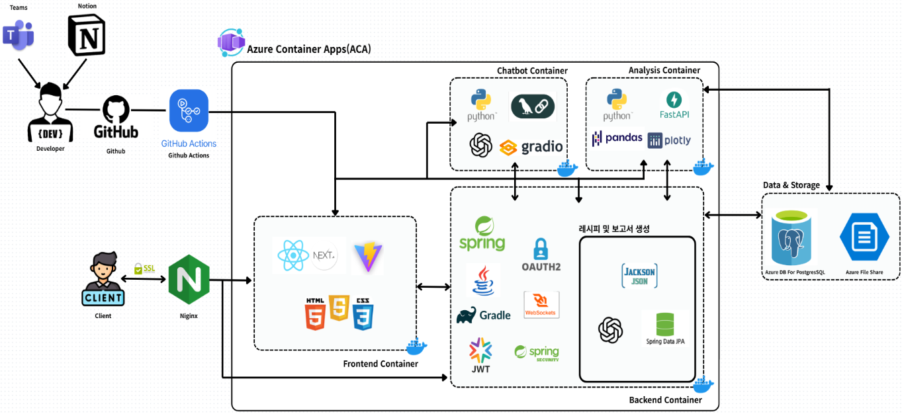
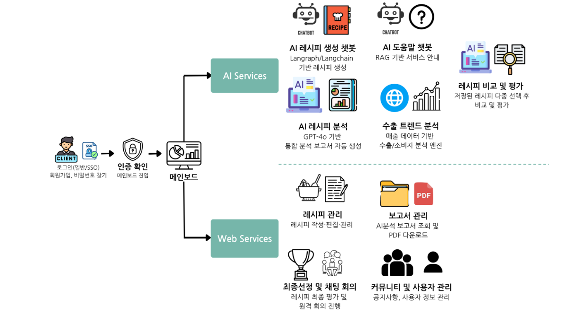

# K-food 수출 및 현지화 지원 플랫폼 (BigProject)

[](https://github.com/FairyGina/bigProject/actions/workflows/frontend-ci.yml)
[](https://github.com/FairyGina/bigProject/actions/workflows/backend-ci.yml)

---

## 📖 프로젝트 개요

### 서비스 개발 배경

K-푸드는 2025년 수출액 **136.2억 달러**를 기록하며 역대 최대 수출 실적을 달성했습니다.  
그러나 이와 동시에 다음과 같은 심각한 문제들이 지속되고 있습니다.

| ⚠️ 문제 | 내용 |
|---------|------|
| 🔴 높은 실패율 | 직관 의존적 개발로 **80% 이상** 신제품 실패 |
| 🔴 규제 리스크 | 국가별 성분/라벨링 규제로 인한 **통관 거부** |
| 🔴 고비용 구조 | 해외 시장조사의 막대한 **시간과 비용 소모** |

> **데이터 기반의 정밀한 현지화 전략을 통해 신제품 개발의 시행착오를 줄이고,  
> K-푸드의 글로벌 경쟁력을 질적으로 고도화할 필요성에서 출발했습니다.**

---

### 서비스 목표

검증된 데이터셋과 AI를 활용한 **트렌드 기반 레시피**와 **보고서**를 생성해  
식품 기업의 **신제품 기획을 돕는 의사결정 지원 서비스**

## " K-food 수출 및 현지화 플랫폼 "

| 🍽️ AI 레시피 생성 챗봇 | 📑 보고서 생성 비교 분석 | 📊 수요 예측 시각화 |
|:---:|:---:|:---:|
| LLM 기반 맞춤형 레시피 생성 | AI 심사위원 평가 PDF 리포트 | K-Food 트렌드 데이터 시각화 |

---

## 🏗️ 시스템 아키텍처



이 프로젝트는 성격이 서로 다른 AI 서비스(챗봇, 분석 엔진)를 독립 컨테이너로 분리하고,  
나머지 백엔드 비즈니스 로직은 **Spring Boot 단일 애플리케이션**으로 통합 운영하는  
**준(Semi) MSA 구조**를 채택했습니다.

### 서비스 구성

| 서비스 | 기술 스택 | 역할 |
|--------|----------|------|
| **Frontend** | React 18, Vite, TailwindCSS | 사용자 인터페이스 |
| **Backend (Core)** | Spring Boot 3.x, Java 17 | 인증·DB·라우팅 통합 처리 |
| **AI Chatbot** | Python, LangGraph, GPT-4o | 레시피 생성 AI (독립 컨테이너) |
| **Analysis Engine** | Python, FastAPI, Pandas | 데이터 분석·시각화 (독립 컨테이너) |
| **Helper Chatbot** | Python | 서비스 도우미 챗봇 (독립 컨테이너) |
| **Infrastructure** | Azure Container Apps, PostgreSQL | 클라우드 배포 및 데이터 저장 |

> 💡 **아키텍처 선택 이유**  
> 챗봇과 분석 엔진은 Spring Boot와 언어/런타임이 완전히 달라 독립 배포가 필수입니다.  
> 반면, 나머지 비즈니스 로직은 하나의 Spring Boot 앱으로 통합함으로써  
> 팀 규모에 맞는 개발·운영 효율을 확보했습니다.

---

## 🚀 주요 기능 (Key Features)

### 1. 🥑 AI 레시피 생성 (챗봇 서비스)



**레시피 생성/저장 흐름**
- **수요 예측 (LightGBM)** + **최신 외식 트렌드 (SerpAPI)** 데이터를 결합
- AI기반 레시피 생성 (LLM Chatbot) → 표준 레시피 최적화 → 사용자 요구사항 반영 → 최종 레시피 고도화
- 사용자 맞춤 레시피 DB 저장

**보고서 생성/저장 흐름**
- AI기반 보고서 생성 (타깃 국가, 페르소나, 금액설정, 레시피 정보)
- **데이터 통합 분석**: 마케팅(인플루언서) 타깃 분석 / 수출 통관 리스크 진단 / 식품 안전성 규제 검토 / 국가별 레시피 평가 점수화 및 피드백
- 비즈니스 리포트 생성 및 PDF 저장

### 2. 📊 데이터 분석 서비스

**분석 데이터 소스**

| 데이터 | 내용 |
|--------|------|
| **수출 데이터** | 국가/품목 수출입 트렌드 분석, 수출액/증량 추이 추출, 물품 트렌드·경제 상관분석 |
| **아마존 리뷰 데이터** | NLP 기반 감성 분석, 소비자 경험 지표 산출 (품질·경험·만족요인) |

**비즈니스 보고서 산출물**
- AI 심사위원 분석 지표 제공 (맛·건강·가격·충점)
- SWOT 및 KPI 기반 시장성 검토
- 최적 레시피 제안 및 전략 수립

### 3. 📑 자동 보고서 생성 (PDF Automation)

- **원클릭 리포트**: AI 심사위원단이 레시피를 평가하고 PDF 문서로 자동 생성
- 타깃 국가, 타깃 페르소나, 마케팅 전략까지 포함한 종합 비즈니스 리포트

### 4. 🔐 보안 구성

- **Naver OAuth2 로그인**: 기존 네이버 아이디로 빠르고 안전한 로그인
- **CSRF & CORS 정책**: 브라우저 요청 CSRF 토큰 검증, 내부 서비스 간 통신 예외 처리
- **보안 쿠키**: `SameSite=None`, `Secure` 속성으로 크로스 도메인 인증 유지
- **데이터 암호화**: BCrypt 알고리즘으로 민감 정보 저장

---

## 🔄 CI/CD 파이프라인

개발자가 코드를 푸시하면 GitHub Actions가 자동으로 빌드·테스트·배포를 수행합니다.

```
[Code Push]
    │
    ├─ frontend/** 변경 → Frontend CI (Node.js Build → Lint → Test → Docker Image)
    ├─ src/**     변경 → Backend CI  (Gradle Build → Unit Test)
    ├─ analysis-engine/** 변경 → Analysis CI (Docker Image Build)
    └─ ai-chatbot/**     변경 → Chatbot CI  (Docker Image Build)
                                    │
                               [ACR Push]
                          Azure Container Registry
                          (bpback / bpfront / bpanalysis / bpchatbot)
                                    │
                            [ACA Auto Deploy]
                         Azure Container Apps 자동 업데이트
```

### CI/CD 단계 요약

| 단계 | 내용 |
|------|------|
| **1. Trigger** | `main` 또는 `cloud` 브랜치 push 시 변경 경로 감지 후 실행 |
| **2. Build & Test** | Frontend(Node.js 빌드), Backend(Gradle 컴파일·테스트), Python 서비스(Docker 빌드) |
| **3. Container Registry** | Azure Container Registry(ACR)에 버전 태그 이미지 저장 |
| **4. Deploy** | Azure Container Apps(ACA)가 새 이미지를 감지하여 자동 배포 |

---

## 🛠️ 기술 스택 (Tech Stack)

### Frontend
- **Framework**: React 18, Vite 5
- **Style**: TailwindCSS
- **State**: Context API, React Query

### Backend (Core)
- **Framework**: Spring Boot 3.2, Spring Security 6
- **Language**: Java 17
- **Build**: Gradle

### AI & 분석 서비스 (독립 컨테이너)
- **Language**: Python 3.11
- **Libraries**: Pandas, Scikit-learn, LightGBM, LangChain, LangGraph
- **AI Model**: OpenAI GPT-4o
- **Framework**: FastAPI, Gradio
- **외부 API**: SerpAPI (트렌드 검색)

### DevOps & Infrastructure
- **Container**: Docker, Docker Compose
- **CI/CD**: GitHub Actions
- **Cloud**: Azure Container Apps (Serverless)
- **Registry**: Azure Container Registry (ACR)
- **Database**: PostgreSQL 16 (Managed Service)

---

## 🏃‍♂️ 시작하기 (Getting Started)

### 로컬 개발 환경 설정

**1. 저장소 클론**
```bash
git clone https://github.com/FairyGina/bigProject.git
cd bigProject
```

**2. 환경 변수 설정**  
`.env.example` 파일을 복사하여 `.env` 파일을 생성하고, 필요한 API 키를 입력합니다.
```bash
cp .env.example .env
# .env 파일에서 OpenAI API Key, Naver Client ID 등을 설정하세요
```

**3. 서비스 실행 (Docker Compose)**
```bash
docker-compose up -d --build
```

**4. 접속 주소**

| 서비스 | 주소 |
|--------|------|
| **Frontend** | http://localhost:5173 |
| **Backend API** | http://localhost:8080 |
| **AI Chatbot** | http://localhost:7860 |
| **Analysis Engine** | http://localhost:8000 |
